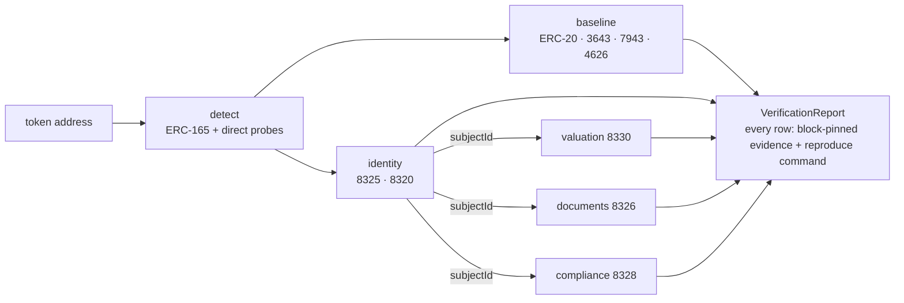

<div align="center">

# rwa-verify

**Read-side verification for tokenised real-world assets.**

Give it a token. It tells you what the token declares, whether those declarations hold on-chain, and hands you the command to check every claim yourself.

[](https://github.com/fepvenancio/rwa-verify/actions/workflows/ci.yml)
[](LICENSE)
[](specs/PINNED.md)

**[Open the explorer →](https://rwa-verify-explorer.stela-app.workers.dev)** · [API](https://rwa-verify-explorer.stela-app.workers.dev/api/v1) · [Check reference](packages/sdk/CHECKS.md) · [Spec findings](docs/spec-findings.md)

</div>

---

## What it is

Tokenised real-world assets make claims: *this token is bound to a legal anchor*, *these documents back it*, *this is its NAV and it is fresh*, *a licensed party attested it*. Today most of those claims live in PDFs. A new family of Ethereum standards puts them on-chain:

| Layer | Standard | What it commits |
|---|---|---|
| Identity | [ERC-8325](specs/erc-8325.md) Asset Anchor Registry · [ERC-8320](specs/erc-8320.md) Regulated Asset Claim | token ↔ off-chain asset binding, regulator-style claims |
| Documents | [ERC-8326](specs/erc-8326.md) Canonical Document Bundle Anchor | deterministic hash of the legal document set |
| Valuation | [ERC-8330](specs/erc-8330.md) NAV Snapshot Oracle | NAV with corrections, invalidation and two staleness signals |
| Compliance | [ERC-8328](specs/erc-8328.md) Compliance Event Log | append-only event history with correction chains |
| Baseline | [ERC-3643](specs/erc-3643.md) · [ERC-7943](specs/erc-7943.md) · [ERC-4626](specs/erc-4626.md) | what live RWA tokens implement today |

`rwa-verify` is the **consumer side** of that stack. It reads, it never writes. We deploy no registries, hold no keys and are nobody's authority: the chain is. When a token does not declare a standard the report says *not declared*, never *failed*, so the tool is useful on the 130+ ERC-3643 tokens live today ([list](docs/known-erc3643-mainnet.md)) as well as on tokens that adopt the new layers.

## How it works



1. **Detect.** ERC-165 where the spec defines an interface id, direct function probes where it does not (ERC-3643 has no id; real T-REX tokens do not implement ERC-165).
2. **Baseline.** Facts any token can answer today: ERC-20 metadata, ERC-3643 identity registry, compliance, claim topics, trusted issuers, holder verification, ERC-7943 transfer gates, ERC-4626 asset and total assets.
3. **Verified layers.** When declared: ERC-8325 six-condition mutual binding, ERC-8326 active bundle, ERC-8330 NAV honouring both staleness flags and the correction chain, ERC-8328 current terminal event, ERC-8320 active claims with asset-side registry approval.
4. **Report.** One `CheckResult` per check with a status, the raw values read at one pinned block, the spec reference at a pinned commit, and a CLI command that re-runs exactly that check.

Status vocabulary: `pass` · `fail` · `stale` (NAV beyond a threshold) · `unknown` (could not determine) · `unsupported` (not declared, [ADR-004](docs/adr/ADR-004-baseline-first.md)).

## Try it

**Explorer.** https://rwa-verify-explorer.stela-app.workers.dev — paste a chain id and a token. Examples: [Ecowatt, ERC-3643](https://rwa-verify-explorer.stela-app.workers.dev/t/1/0x724ba15845719549ea1ea2f0aac9d75d31dbd818) · [Spark sDAI, ERC-4626](https://rwa-verify-explorer.stela-app.workers.dev/t/1/0x83F20F44975D03b1b09e64809B757c47f942BEeA).

**API.**

```bash
curl "https://rwa-verify-explorer.stela-app.workers.dev/api/v1/verify?chain=1&token=0x724ba15845719549ea1ea2f0aac9d75d31dbd818"
```

**CLI.** Every `reproduce` string in a report is one of these:

```bash
rwa-verify check erc3643.identityRegistry --chain 1 --token 0x724ba15845719549ea1ea2f0aac9d75d31dbd818 --rpc $RPC_URL
```

**SDK.**

```ts
import { createPublicClient, http } from "viem";
import { verify } from "@rwa-verify/sdk";

const client = createPublicClient({ transport: http(process.env.RPC_URL) });
const report = await verify({ client, chainId: 1, token: "0x724b…d818", registryHints: {} });
```

**Rebuild an ERC-8326 bundle hash from raw documents** with `@rwa-verify/canon`: RFC 8785 JSON, Canonical XML 1.1, filename and MIME hashing, then the spec's ordering and leaf derivation. Differentially tested against an independent Solidity implementation.

**Gate collateral on-chain** with the `RwaVerify` Solidity view library (`bindingValid`, `navFresh`, `hasActiveClaim`, `latestCurrentEvent`) and the `CollateralGate` example.

## Packages

| Package | Purpose |
|---|---|
| [`packages/sdk`](packages/sdk) | viem ABIs, detection, 21 checks, identity adapters, `rwa-verify` CLI |
| [`packages/canon`](packages/canon) | ERC-8326 canonicaliser and bundle hash, `rwa-canon` CLI |
| [`packages/core`](packages/core) | `CheckResult`, `VerificationReport`, `AssetIdentity`, pinned spec refs |
| [`packages/solidity`](packages/solidity) | `RwaVerify` view library, `BundleHashLib`, `CollateralGate`, Foundry tests |
| [`packages/indexer`](packages/indexer) | Ponder indexer for correction chains, supersession and claim lifecycle |
| [`packages/explorer`](packages/explorer) | The explorer and REST API (Next.js on Cloudflare Workers) |

## Why you can trust the output

- **Spec text is the source of truth.** All ERC texts are vendored at one `ethereum/ERCs` commit ([ADR-001](docs/adr/ADR-001-spec-pinning.md)); bumps are explicit PRs.
- **Differential tests.** Hashing and lifecycle logic is checked against a second, independent implementation: TypeScript versus Solidity for bundle hashes, off-chain resolution versus on-chain `currentSnapshotIndex` for NAV corrections, and the CC0 ERC-8320 reference registry for claims.
- **Every check is reproducible.** CI re-executes each emitted `reproduce` command against a real Anvil fixture stack and asserts the same result.
- **Real-world validation.** The ERC-3643 checks were run against 130 live mainnet tokens; where older T-REX versions diverge from the spec text, the report says `unsupported` and the finding is [filed upstream](docs/spec-findings.md).
- **No custody, no authority.** [ADR-002](docs/adr/ADR-002-two-identity-roots.md) takes no side between identity standards; [ADR-005](docs/adr/ADR-005-clean-room.md) keeps the code base clean-room.

## Develop

```bash
pnpm install
pnpm typecheck && pnpm test     # TypeScript packages (includes an Anvil e2e when foundry is installed)
pnpm test:sol                   # Foundry
pnpm test:diff                  # TypeScript canonicaliser vs Solidity BundleHashLib (FFI)
pnpm test:indexer               # indexer vs on-chain resolution on Anvil
scripts/fixture-stack.sh        # local Anvil with a full 8320/8325/8326/8328/8330 stack
```

Agent and contributor rules live in [CLAUDE.md](CLAUDE.md); the plan in [PLAN.md](PLAN.md).

## Status

Phases 0–3 of the plan are complete: SDK, canonicaliser, Solidity library, indexer and hosted explorer. Next: npm and Foundry registry publication, upstream feedback in the ERC Review threads, and grant applications with these artefacts as evidence.

## License

MIT. Vendored spec texts and the ERC-8320 reference implementation are CC0 from `ethereum/ERCs`; see [LICENSE-THIRD-PARTY.md](LICENSE-THIRD-PARTY.md).
